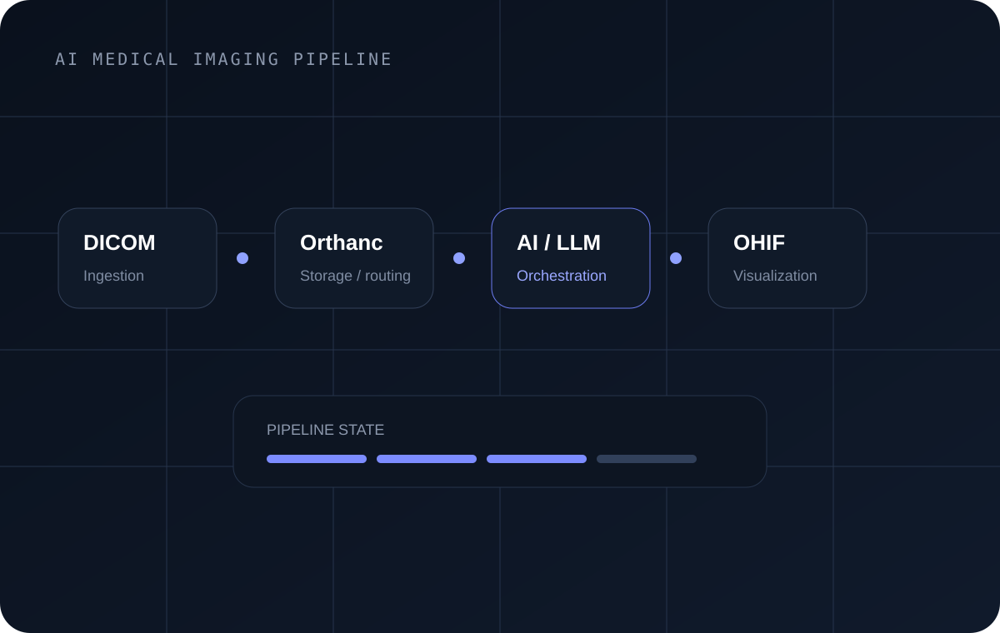
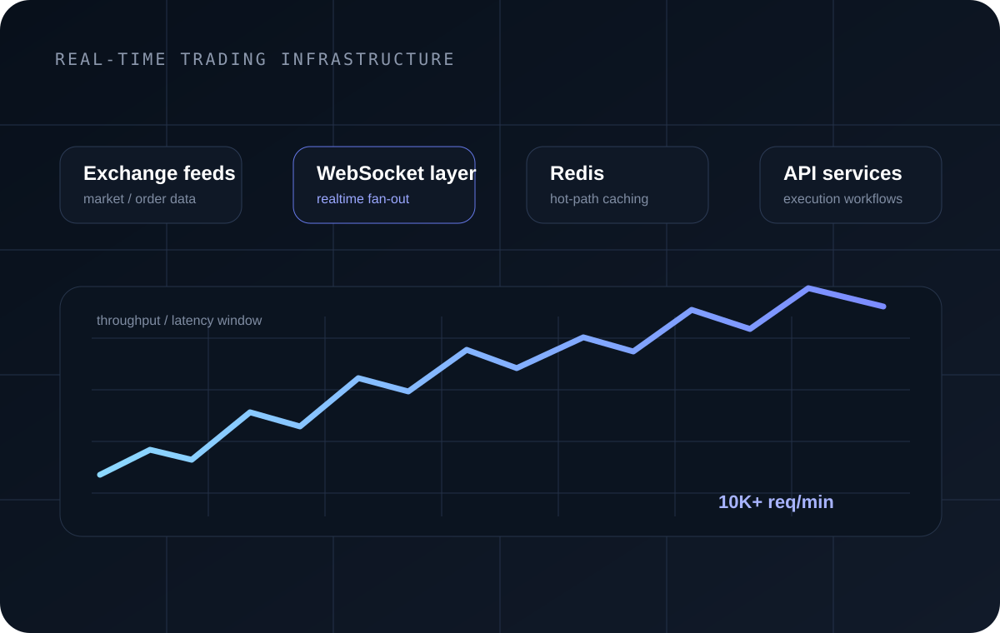

# Yash Jangid — Senior Full Stack Engineer

<p align="center">
  
</p>

<p align="center">
  <strong>Healthcare AI · Real-time Systems · Agentic Development · Product Engineering</strong>
</p>

<p align="center">
  <a href="https://in.linkedin.com/in/yashjangid091099">LinkedIn</a> ·
  <a href="https://github.com/gityash2024">GitHub</a> ·
  <a href="mailto:gityash2024@gmail.com">Email</a>
</p>

---

## About this portfolio

This repository contains my personal engineering portfolio. It is designed as a polished, high-performance static experience focused on the systems I have built, the engineering decisions behind them, and measurable production impact.

The site deliberately avoids fake client screenshots, stock imagery and placeholder media. My real portrait is stored in the repository, while project visuals are purpose-built architecture/workflow illustrations based on the actual systems described in the case studies.

## Professional profile

I am a Senior Full Stack Engineer based in Gurugram, India, with nearly five years of experience building production software across healthcare AI, real-time trading, Web3, job-tech and enterprise products.

My current work at Imaging IQ focuses on healthcare AI and medical-imaging workflows involving React, Node.js, DICOM/NIfTI, OHIF Viewer, Orthanc, orchestration services, LLM workflows and AI-assisted analysis.

Previously at ITH Technologies, I worked across full-stack product development, microservices, real-time systems, Web3 platforms, reusable engineering packages and CI/CD infrastructure.

## Engineering impact

- 10,000+ users served across production platforms
- 10,000+ API requests/minute handled in real-time trading systems
- Sub-100ms critical response paths
- 40% reduction in server latency
- Deployment time reduced from roughly 2 hours to 15 minutes
- 99.9% uptime across production Web3 platforms
- 5+ Web3 platforms architected and deployed
- 8+ reusable internal npm packages created

## Selected work

### AI Medical Imaging Pipeline Platform

Healthcare AI platform work spanning DICOM/NIfTI ingestion, medical-image visualization, OHIF Viewer, Orthanc, backend orchestration, workflow state and AI-assisted analysis.



**Core stack:** React · Node.js · DICOM · NIfTI · OHIF · Orthanc · LLM orchestration

### CEX / DEX Strategy Portal

High-throughput trading infrastructure built around synchronized market data, exchange/order workflows, Redis caching and WebSocket-driven updates.



**Core stack:** React · Node.js · Redis · WebSockets · Web3.js

### Recruin

Recruiting platform covering candidate matching, applicant tracking, secure access, real-time chat and file workflows for 5,000+ active users.


**Core stack:** React · Node.js · MongoDB · Redux · AWS S3

### TDX Launchpad

Production Web3 launchpad with product workflows, analytics, KYC/AML-oriented flows, REST APIs and real-time reporting.

**Core stack:** React · Node.js · MongoDB · Web3.js

## Skills

**Frontend:** TypeScript, JavaScript, React, Redux Toolkit, responsive product interfaces, workflow-heavy UI

**Backend & architecture:** Node.js, Express, REST APIs, WebSockets, microservices, system design, MongoDB, Redis, JWT, Socket.io

**AI / agentic engineering:** LLM orchestration, agentic workflows, MCP, structured tool execution, OpenAI Codex, Claude Code, Cursor, Antigravity

**Healthcare AI:** DICOM, NIfTI, OHIF Viewer, Orthanc, medical-imaging pipelines

**Cloud & delivery:** AWS EC2/S3/Lambda, Docker, Nginx, GitHub Actions, CI/CD, Jest, Mocha, Postman

## Portfolio structure

```text
.
├── index.html                         # Main landing page
├── about/index.html                   # About / engineering story
├── work/index.html                    # Selected work overview
├── work/medical-imaging/index.html    # Healthcare AI case study
├── work/trading-infrastructure/       # Real-time trading case study
├── work/recruin/                      # Recruin case study
├── contact/index.html                 # Contact page
├── resume/index.html                  # Printable résumé
├── assets/                            # Real portrait + project visuals
├── styles.css                         # Base visual system
├── v2.css                             # Premium layout/design layer
├── v3.css                             # Final polish/responsive layer
├── script.js                          # Navigation, GSAP and interactions
├── v3.js                              # Parallax and premium micro-interactions
└── vercel.json                        # Vercel routing/security configuration
```

## Motion & interaction

The portfolio uses GSAP and ScrollTrigger for progressive reveal animation, subtle parallax, hero motion and scroll-driven interactions. Additional custom JavaScript provides magnetic button interactions, card perspective motion, mobile navigation and live IST time display.

The experience also respects `prefers-reduced-motion` so motion-heavy effects are disabled for users who request reduced animation.

## Design direction

The visual system uses a restrained graphite/navy base with indigo and cool-blue accents, editorial typography, compact hierarchy, deliberate spacing, glass navigation and architecture-focused project visuals. The goal is to feel like a senior engineer's product portfolio rather than a generic template or AI-generated landing page.

## Pages

- `/` — Home
- `/about` — Background, journey, engineering principles and recognition
- `/work` — Selected engineering work
- `/work/medical-imaging` — AI Medical Imaging case study
- `/work/trading-infrastructure` — CEX/DEX Strategy Portal case study
- `/work/recruin` — Recruin case study
- `/resume` — Browser-friendly résumé with Print / Save PDF support
- `/contact` — Contact and opportunity-fit page

## Local preview

Because the portfolio is static, no build step is required.

```bash
python -m http.server 8080
```

Then open `http://localhost:8080`.

## Deployment

The repository is configured for Vercel through `vercel.json`. The production branch is `main`. When the Vercel project is linked to this GitHub repository, pushes to `main` should trigger production deployments automatically.

## Recognition & education

- Technical Excellence Award — 2023
- Most Promising Newcomer — 2023
- B.Tech Computer Science, UPES — GPA 8.9/10, 2022

## Contact

**Yash Jangid**  
Senior Full Stack Engineer  
Gurugram, India  
Email: gityash2024@gmail.com  
LinkedIn: https://in.linkedin.com/in/yashjangid091099  
GitHub: https://github.com/gityash2024
